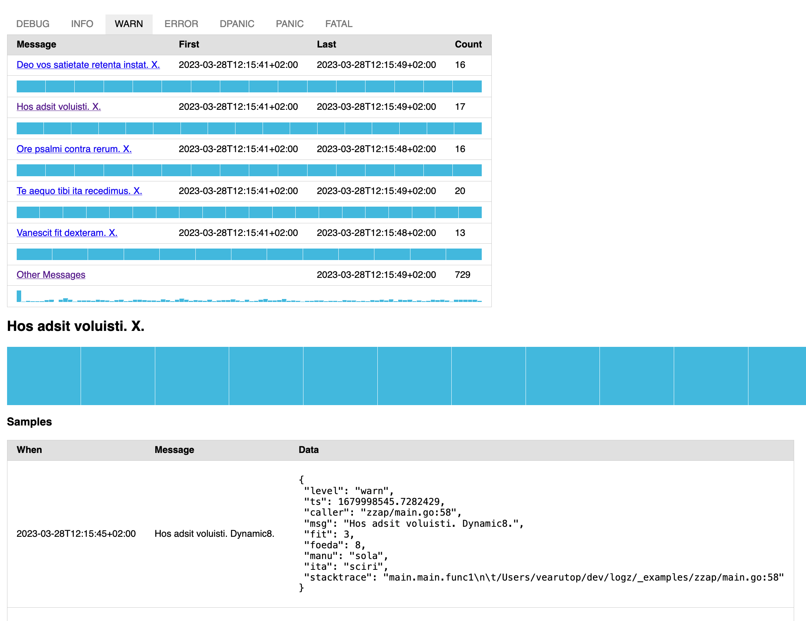

# logz


This library provides in-process aggregated collector of messages and web page to report them. 
They are useful for last mile observability of logs.

`logz` is inspired by [OpenCensus zPages](https://opencensus.io/zpages/).

[](https://github.com/bool64/logz/actions?query=branch%3Amaster+workflow%3Atest)
[](https://codecov.io/gh/bool64/logz)
[](https://pkg.go.dev/github.com/bool64/logz)
[](https://wakatime.com/badge/github/bool64/logz)


## Features

* High performance and low resource consumption.
* Adapter for [`go.uber.org/zap`](./zzap).
* Adapter for [`github.com/bool64/ctxd`](./ctxz).
* HTTP handler to serve aggregated messages.



## Example for `go.uber.org/zap`

```go
zc := zap.NewDevelopmentConfig()
zz, lo := zzap.NewOption(logz.Config{
    MaxCardinality: 5,
    MaxSamples:     10,
})

l, err := zc.Build(zz)
if err != nil {
    panic(err)
}

l.Debug("starting example")
l.Sugar().Infow("sample info", "one", 1, "two", 2)
l.Error("unexpected end of the world")

l.Info("starting server at http://localhost:6060/")
err = http.ListenAndServe("0.0.0.0:6060", logzpage.Handler(lo...))
if err != nil {
    l.Fatal(err.Error())
}
```

## Example for `github.com/bool64/ctxd`

```go
var logger ctxd.Logger

lz := ctxz.NewObserver(logger, logz.Config{
    MaxCardinality:      100,
    MaxSamples:          50,
    DistRetentionPeriod: 72 * time.Hour,
})
logger = lz

ctx := context.TODO()

logger.Debug(ctx, "starting example")
logger.Info(ctx, "sample info", "one", 1, "two", 2)
logger.Error(ctx, "unexpected end of the world")

logger.Important(ctx, "starting server at http://localhost:6060/")

err := http.ListenAndServe("0.0.0.0:6060", logzpage.Handler(lz.LevelObservers()...))
if err != nil {
    logger.Error(ctx, err.Error())
    os.Exit(1)
}
```